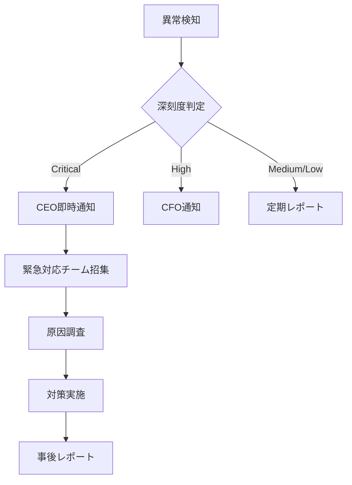

# セキュリティ仕様書

## 概要

BAYSGAiA財務改革システムのセキュリティ要件と実装仕様を定義します。金融データを扱うシステムとして、最高水準のセキュリティを確保します。

## セキュリティ原則

1. **最小権限の原則**: 必要最小限のアクセス権限のみ付与
2. **多層防御**: 複数のセキュリティレイヤーで保護
3. **ゼロトラスト**: すべてのアクセスを検証
4. **監査可能性**: 全操作の記録と追跡可能性

## 認証・認可

### 認証方式

#### Phase 2（現在）
```typescript
// JWT認証の実装
interface AuthConfig {
  jwtSecret: string;
  tokenExpiry: number; // 3600秒（1時間）
  refreshTokenExpiry: number; // 604800秒（7日）
}
```

#### Phase 3（予定）
- 多要素認証（MFA）導入
- FIDO2/WebAuthn対応
- リスクベース認証

### 認可モデル

```typescript
enum Role {
  CEO = 'CEO',
  CFO = 'CFO',
  ADVISOR = 'ADVISOR',
  OPERATOR = 'OPERATOR',
  VIEWER = 'VIEWER'
}

interface Permission {
  resource: string;
  actions: ('create' | 'read' | 'update' | 'delete')[];
}

const rolePermissions: Record<Role, Permission[]> = {
  CEO: [
    { resource: '*', actions: ['create', 'read', 'update', 'delete'] }
  ],
  CFO: [
    { resource: 'financial', actions: ['create', 'read', 'update'] },
    { resource: 'reports', actions: ['read'] }
  ],
  // ... 他のロール定義
};
```

## データ保護

### 暗号化

#### 保存時暗号化
```typescript
// AES-256-GCM暗号化
const encryptionConfig = {
  algorithm: 'aes-256-gcm',
  keyDerivation: 'PBKDF2',
  iterations: 100000,
  saltLength: 32
};
```

#### 通信時暗号化
- HTTPS必須（TLS 1.2以上）
- HSTS有効化
- 証明書ピンニング（モバイルアプリ）

### 機密データ管理

```typescript
// 機密データのマスキング
function maskSensitiveData(data: string, type: 'account' | 'amount'): string {
  switch (type) {
    case 'account':
      return data.replace(/^(.{4}).*(.{4})$/, '$1****$2');
    case 'amount':
      return data.replace(/\d/g, '*');
  }
}

// 環境変数による機密情報管理
interface SecureConfig {
  GMO_AOZORA_CLIENT_SECRET: string;
  DATABASE_ENCRYPTION_KEY: string;
  JWT_SECRET: string;
}
```

## アクセス制御

### API Rate Limiting

```typescript
const rateLimitConfig = {
  windowMs: 15 * 60 * 1000, // 15分
  max: 100, // 最大100リクエスト
  keyGenerator: (req: Request) => {
    return req.user?.id || req.ip;
  },
  handler: (req: Request, res: Response) => {
    res.status(429).json({
      error: 'Too many requests',
      retryAfter: req.rateLimit.resetTime
    });
  }
};
```

### IPアドレス制限

```typescript
const allowedIPs = process.env.ALLOWED_IPS?.split(',') || [];

const ipWhitelist = (req: Request, res: Response, next: NextFunction) => {
  const clientIP = req.ip;
  if (allowedIPs.includes(clientIP) || process.env.NODE_ENV === 'development') {
    next();
  } else {
    res.status(403).json({ error: 'Access denied' });
  }
};
```

## 監査・ログ

### 監査ログ仕様

```typescript
interface AuditLog {
  id: string;
  timestamp: Date;
  userId: string;
  userRole: Role;
  action: string;
  resource: string;
  ipAddress: string;
  userAgent: string;
  result: 'success' | 'failure';
  errorDetails?: string;
  dataBeforeChange?: any;
  dataAfterChange?: any;
}

// 監査ログの記録
async function recordAudit(log: AuditLog): Promise<void> {
  // 改ざん防止のためハッシュ値を付与
  const logWithHash = {
    ...log,
    hash: generateHash(log),
    previousHash: await getPreviousLogHash()
  };
  
  await auditDB.insert(logWithHash);
}
```

### ログ保存要件

- **保存期間**: 7年間（電子帳簿保存法準拠）
- **完全性**: ハッシュチェーンによる改ざん検知
- **可用性**: 99.9%以上
- **検索性**: インデックス化による高速検索

## 脆弱性対策

### OWASP Top 10対策

1. **インジェクション対策**
```typescript
// パラメータ化クエリの使用
const query = 'SELECT * FROM transactions WHERE user_id = $1 AND date = $2';
const values = [userId, date];
const result = await db.query(query, values);
```

2. **認証の不備対策**
- セッションタイムアウト: 30分
- パスワードポリシー: 12文字以上、複雑性要件
- アカウントロックアウト: 5回失敗で15分ロック

3. **XSS対策**
```typescript
// Content Security Policy
app.use(helmet({
  contentSecurityPolicy: {
    directives: {
      defaultSrc: ["'self'"],
      scriptSrc: ["'self'", "'unsafe-inline'"],
      styleSrc: ["'self'", "'unsafe-inline'"],
      imgSrc: ["'self'", "data:", "https:"],
    },
  },
}));
```

### セキュリティヘッダー

```typescript
app.use((req, res, next) => {
  res.setHeader('X-Frame-Options', 'DENY');
  res.setHeader('X-Content-Type-Options', 'nosniff');
  res.setHeader('X-XSS-Protection', '1; mode=block');
  res.setHeader('Referrer-Policy', 'strict-origin-when-cross-origin');
  res.setHeader('Permissions-Policy', 'geolocation=(), microphone=(), camera=()');
  next();
});
```

## インシデント対応

### 検知と対応フロー



### 自動検知ルール

```typescript
const securityRules = [
  {
    name: '大量データアクセス',
    condition: (logs: AuditLog[]) => {
      const count = logs.filter(l => l.action === 'export').length;
      return count > 100;
    },
    severity: 'high',
    action: 'notify_cfo'
  },
  {
    name: '深夜アクセス',
    condition: (log: AuditLog) => {
      const hour = new Date(log.timestamp).getHours();
      return hour < 6 || hour > 22;
    },
    severity: 'medium',
    action: 'log_anomaly'
  }
];
```

## コンプライアンス

### 電子帳簿保存法対応

```typescript
interface TaxDocument {
  id: string;
  documentType: string;
  originalData: Buffer;
  timestamp: {
    created: Date;
    timestampAuthority: string;
    hash: string;
  };
  searchableFields: {
    date: Date;
    amount: number;
    counterparty: string;
    documentNumber: string;
  };
}
```

### 個人情報保護

- 最小限の個人情報収集
- 暗号化による保護
- アクセスログの記録
- 定期的な棚卸し

## セキュリティテスト

### 定期実施項目

1. **脆弱性スキャン**: 月次
2. **ペネトレーションテスト**: 四半期
3. **セキュリティ監査**: 半期
4. **災害復旧訓練**: 年次

### 自動セキュリティテスト

```json
{
  "scripts": {
    "security:audit": "npm audit --production",
    "security:scan": "trivy fs --security-checks vuln .",
    "security:owasp": "owasp-dependency-check --project .",
    "security:secrets": "trufflehog filesystem . --json"
  }
}
```

## バックアップ・災害復旧

### バックアップ戦略

- **頻度**: 
  - データベース: 日次フルバックアップ + 時間毎差分
  - ファイル: リアルタイム同期
- **保存先**: 
  - プライマリ: 東京リージョン
  - セカンダリ: 大阪リージョン
- **保存期間**: 90日間
- **復旧目標**: 
  - RTO（復旧時間目標）: 4時間
  - RPO（復旧時点目標）: 1時間

## セキュリティ教育

### 必須トレーニング

1. **全従業員**: 
   - 情報セキュリティ基礎（年1回）
   - フィッシング対策（四半期）

2. **開発者**: 
   - セキュアコーディング（年2回）
   - OWASP Top 10対策（年1回）

3. **管理者**: 
   - インシデント対応（年2回）
   - リスク管理（年1回）

## 実装チェックリスト

### Phase 2（必須実装）
- [ ] JWT認証
- [ ] 基本的なロールベース制御
- [ ] HTTPS通信
- [ ] 基本的な監査ログ
- [ ] SQLインジェクション対策

### Phase 3（実装予定）
- [ ] 多要素認証
- [ ] 高度な異常検知
- [ ] 自動脆弱性スキャン
- [ ] DDoS対策
- [ ] WAF導入

### Phase 4（将来拡張）
- [ ] ゼロトラストアーキテクチャ
- [ ] AI/MLベースの脅威検知
- [ ] ブロックチェーン監査証跡
- [ ] 量子暗号対応準備